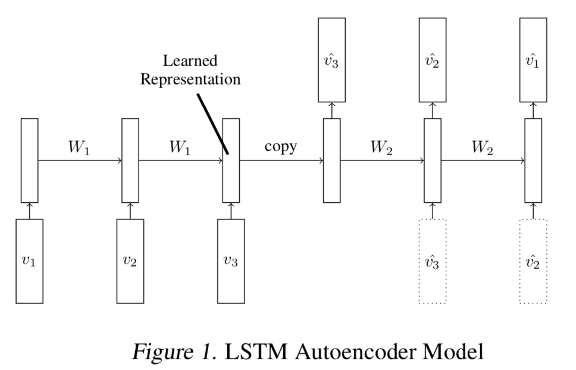

# Introduction
We want to qualitatively estimate the visual diversity within our drive data. For measuring scene diversity we want to use visual semantic similarity of the drives. F.example drives in high traffic density vs drives of vehicle waiting at traffic lights. 
# Training/Validation Data
We use pre-trained ResNet50 features extracted from BDD100K videos as our per-frame visual representation. To reduce computation we downsample the [BDD100K](https://bdd-data.berkeley.edu) videos(30fps@1280x720) as 5fps@640x360. This generates `TMAX`~200 vectors of `D=2048` dimensions per video. We use temporal windows of length `T=64` randomly sampled from `TMAX` positions.

## Video representations

We use a LSTM Autoencoder to model video representation generator. The core idea uses this [paper](http://www.cs.toronto.edu/~rsalakhu/papers/video_lstm.pdf). An encoder LSTM reads in input visual features of shape `[T, D]` and generate a summary vector (or [thought vector](https://gabgoh.github.io/ThoughtVectors)) of shape `S=128`. The decoder LSTM reads in the thought vector and reproduces the input visual features. We regress the reproduced visual features against the input visual features with MSE. The core idea being that the visual features which are redundant between frames are compressed with the Autoencoder. `T, S, D` are hyper-parameters we control to affect model complexity/performance/runtime. The Autoencoder trained at this stage forms the `eLSTM` and `dLSTM` for the next stage.

## Video summarisation

The core idea use this [paper](https://mahasseb.github.io/files/2017/cvpr_video_summarization.pdf) `TODO`
