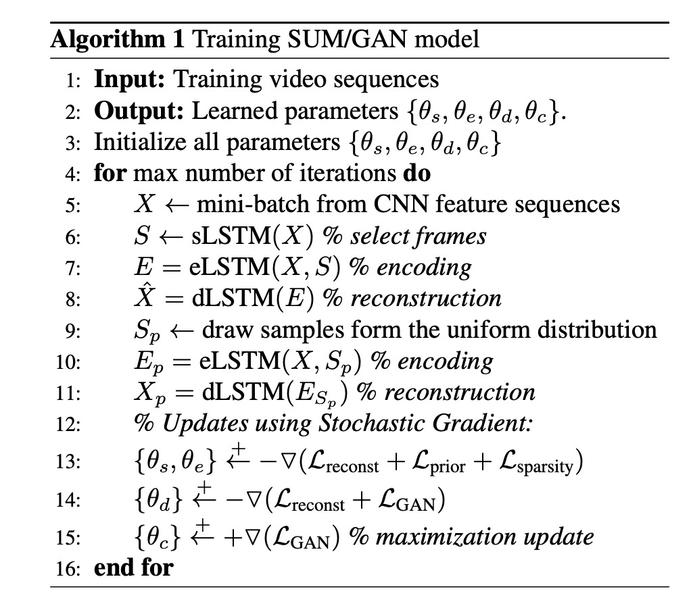

# Introduction
We want to qualitatively estimate the visual diversity within our drive data. For measuring scene diversity we want to use visual semantic similarity of the drives. F.example drives in high traffic density vs drives of vehicle waiting at traffic lights. 
# Training/Validation Data
We use pre-trained ResNet50 features extracted from BDD100K videos as our per-frame visual representation. To reduce computation we downsample the [BDD100K](https://bdd-data.berkeley.edu) videos(30fps@1280x720) as 5fps@640x360. This generates `TMAX`~200 vectors of `D=2048` dimensions per video. We use temporal windows of length `T=64` randomly sampled from `TMAX` positions.

## Video representations

We use a LSTM Autoencoder to model video representation generator. The core idea uses this [paper](http://www.cs.toronto.edu/~rsalakhu/papers/video_lstm.pdf). An encoder LSTM reads in input visual features of shape `[T, D]` and generate a summary vector (or [thought vector](https://gabgoh.github.io/ThoughtVectors)) of shape `S=128`. The decoder LSTM reads in the thought vector and reproduces the input visual features. We regress the reproduced visual features against the input visual features with MSE. The core idea being that the visual features which are redundant between frames are compressed with the Autoencoder. `T, S, D` are hyper-parameters we control to affect model complexity/performance/runtime. The Autoencoder trained at this stage forms the `eLSTM` and `dLSTM` for the next stage.


## Video summarisation


The core idea use this [paper](https://mahasseb.github.io/files/2017/cvpr_video_summarization.pdf) `TODO`

## Getting Started
In the paper it was mentioned that the parameters of eLSTM and dLSTM were initialize 
with the parameters of a pre-trained recurrent autoencoder
model trained on feature sequences from original videos.
They find out that this helps to improve the overall accuracy
and also results in faster convergence. <br>
So the project has 2  main parts: <br>
* Train Lstm-Autoencoder  using original Resnet-50 video features  
* Train the summarizer using the pre-trained weights from first step. 


### Step1 ###
1. #### Train encoder LSTM (bidirectional = False) ####
```
python auto_encoder/train_encoder.py —train_features_list <train_features_list_path> --log_dir <save_logs_dir_path> —model_save_dir <path_to_model_dir>
```
2. #### Train encoder LSTM (bidirectional = True) ####
```
python auto_encoder/train_decoder.py —train_features_list <train_features_list_path> --log_dir <save_logs_dir_path> —model_save_dir <path_to_model_dir>
```
`learning_rate = 1e-4` <br>
`batch_size = 256` <br>
`num_workers = 12` <br>
`n_epochs = 300` <br>
`save_interval = 1000 step` <br>

If you want to change this values you can add the variables as command line arguments.

3. #### Build features index ####
```
python scripts/build_index.py —model_path <path_to_model> —features_list <path to text file containing resnet features files list> —index_path <path_where_to_save_index>
```
this script will help to store all encoded features in a database so we test our model and query by video features. 
4. #### Query for similar scenarios ####
```
python scripts/matcher.py --index_path <path_to_index> --model_path <path_to_model> -features_query <path_to_video_features_file>
```
<code>ex: python scripts/matcher.py -i drives-index.pck -m encoder_lstm.pth-43000 -q 000000_016839bf-0247-432f-8af6-5d33a12a0341-video.npy </code>
The code will return top 5 similar videos. you can adjust the number of returned videos.<br>
In order to compare video features and determine how similar they are, a similarity measure is required.<br>
Here are the most 5 used similarity distances: 
* Euclidean: Arguably the most well known and must used distance metric. The euclidean distance is normally described as the distance between two points “as the crow flies”.
* Manhattan: Also called “Cityblock” distance. Imagine yourself in a taxicab taking turns along the city blocks until you reach your destination.
* Chebyshev: The maximum distance between points in any single dimension.
* Cosine: We won’t be using this similarity function as much until we get into the vector space model, tf-idf weighting, and high dimensional positive spaces, but the Cosine similarity function is extremely important. It is worth noting that the Cosine similarity function is not a proper distance metric — it violates both the triangle inequality and the coincidence axiom.
* Hamming(city block): Given two (normally binary) vectors, the Hamming distance measures the number of “disagreements” between the two vectors. Two identical vectors would have zero disagreements, and thus perfect similarity.

For This index, we used `Chebyshev` distance
### Step2 ###
#### Train summarizer using Lstm-autoencoder pre-trained weights ####

## License

Copyright © 2019 MoabitCoin

Distributed under the MIT License (MIT).